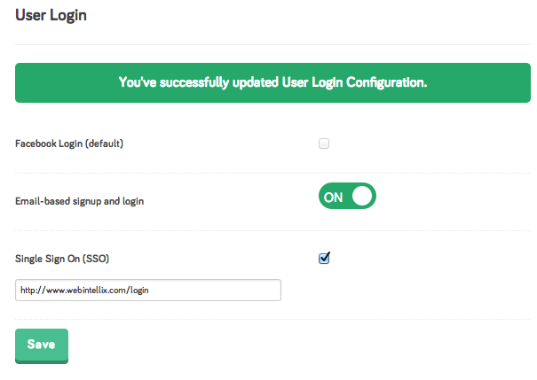

# punchtab

Ruby wrapper for [PunchTab API](http://www.punchtab.com/developer-docs), the world's first instant loyalty platform.

## Installation

```
gem install punchtab
```

## Prerequisites

1. Get a developer account at [PunchTab](http://www.punchtab.com).
2. Make sure your PunchTab account is enabled for SSO authentication. Do so, by going to the developer account page,
and checking the 'Single Sign On (SSO)' checkbox.



## Getting Started

### Authenticate using Single Sign On (SSO):

```ruby
# authenticate with PunchTab
client = Punchtab::Client.new(
  :client_id  => 'your client_id',
  :access_key => 'your access_key',
  :secret_key => 'your secret_key',
  :domain     => 'www.mydomain.com',
  :user_info => {
    :first_name => 'Rupak',
    :last_name  => 'Ganguly',
    :email      => 'me@domain.com'}
)
# if authentication is successful, you should get an access token back
puts "Access Token: #{client.access_token}"

# if authentication fails, an exception is thrown

```
> Note: You can get all of the above values from your Punchtab [developer account page](https://www.punchtab.com/account/).

### Call other Authentication API methods

```
# check status
client.status
```

```
# logout
client.logout
```

### Activity API methods

```
# get all activities
client.get_activity
```

```
# get 2 activities
client.get_activity(:limit => 2)
```

```
# get only 'like' activities
client.get_activity(:activity_name => :like)
```

```
# create a new activity, and assign it relevant 'points'
client.create_activity(:comment, 600)
```

```
# redeem offer for an activity using a 'reward_id'
client.redeem_activity_offer(123)
```

### Leaderboard API methods

### Reward API methods

### User API methods

## Features


## Roadmap

* Add tests

## Note on Patches/Pull Requests

* Fork the project.
* Make your feature addition or bug fix.
* Add tests for it. This is important so I don't break it in a future version unintentionally.
* Commit, do not mess with rakefile, version, or history. (if you want to have your own version, that is fine but
  bump version in a commit by itself I can ignore when I pull)
* Send me a pull request. Bonus points for topic branches.

## Copyright

Copyright (c) 2013 [Rupak Ganguly](http://rails.webintellix.com). See [LICENSE](https://github.com/rupakg/punchtab/blob/master/LICENSE) for details.
